# SynResLoadPattern

Here we introduce the *`ERGAN-Dataset`*, which includes synthetic residential load patterns. These patterns closely emulate the temporal dependencies and distribution features present in genuine training data. It offers a broad and varied collection of load patterns, making it a prime resource for both researchers and practitioners. It's designed for in-depth analysis, simulation, and study in the field of residential electricity consumption.

## Data Description
The *`ERGAN-Dataset`* contains 1,000,000 generated residential load pattern profiles. Each profile represents normalized daily electricity consumption, at 1 hour resolution, with values spanning from 0 to 1.

## Original Dataset
The *`ERGAN-Dataset`* was developed using real data from the Pecan Street database. This database includes hourly electricity consumption data from 417 households, collected over the year 2017. 

## Data Construction Process
<!-- 
The dataset's residential load pattern profiles were synthesized using our proposed Ensemble Recurrent Generative Adversarial Network (ERGAN) Framework, trained on a real-world dataset from the Pecan Street database. This data comprises hourly load data from 417 households over 2017. After normalization, the data was segmented into 10 distinct clusters using the K-Means clustering method, showcasing diverse consumption habits. 

With this clustering in place, the ERGAN framework was tasked to train 10 separate generative models, each corresponding to one of the 10 clusters. The final generated dataset aggregates the output from these 10 distinct generative models. It's crucial to note that the proportion of data in this aggregated dataset mirrors the proportion observed in the original clustered data. This method ensures a diverse and representative set of residential load patterns derived from the foundational Pecan Street database.

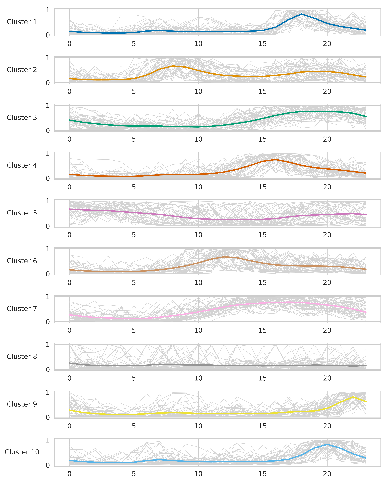

Fig.1: Overview of Synthetic Load Patterns and Clustering Centers Across 10 Distinct Clusters

Fig.1 is the visual representation of these clusters emphasizes the varied load patterns, with each cluster capturing distinct consumption trends. This segmentation underscores the importance of individual generative models for each cluster to capture the intricate nuances of electricity consumption.

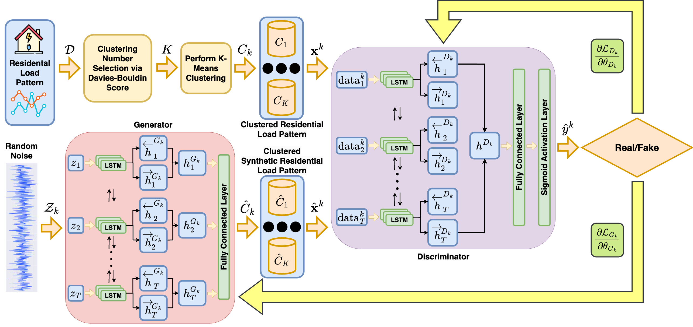

Fig. 2: ERGAN Framework for Synthetic Residential Load Pattern Generation

Fig. 2 illustrates the ERGAN framework, detailing the process from residential load pattern input to the generation of clustered synthetic load patterns. The workflow includes clustering number selection via the Davies-Bouldin score, performing K-Means clustering, and training Bi-LSTM networks for both generator and discriminator components to differentiate between real and synthetic patterns. -->

### Number of Clusters Selection
To create the synthetic load patterns, we first normalized the real data and then grouped it into distinct clusters using the K-Means clustering algorithm. The number of clusters was selected based on the Davies-Bouldin score to ensure an optimal balance between granularity and efficiency.

We evaluated different numbers of clusters and found that 10 clusters provided the best balance. This choice captures the diversity of consumption habits without overfitting the data or creating overly granular clusters that could complicate the generation process. The Davies-Bouldin score for 10 clusters was the lowest among the tested options, indicating well-separated and cohesive clusters.

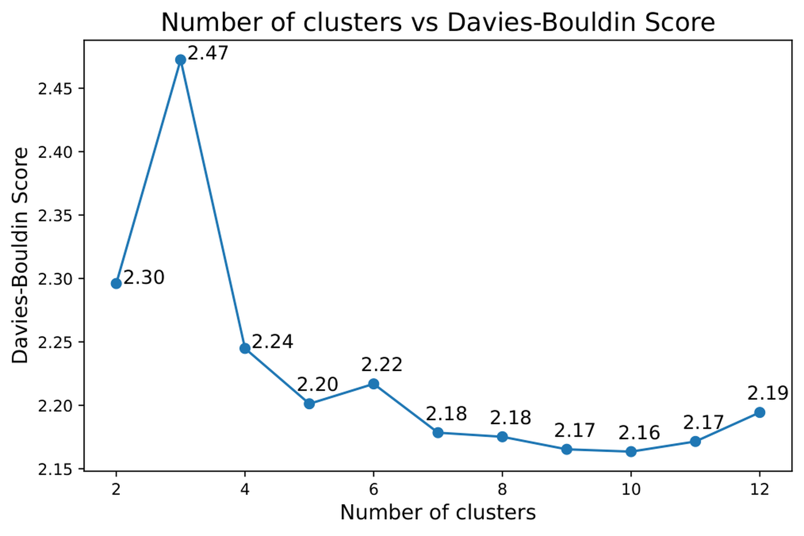

<b>Fig. 1</b>: Selecting the best number of clusters based on the Davies-Bouldin score.

### Generation Framework
Once the clusters were defined, we used the Ensemble Recurrent Generative Adversarial Network (ERGAN) Framework to generate the synthetic load patterns. Each cluster was used to train a separate generative model within the ERGAN framework. The final dataset combines the outputs of these 10 models, maintaining the original proportions of each cluster. 

## Visualization of Cluster Data

<!-- ### Overview of Generated Data -->
The synthetic load patterns are visualized in the context of the 10 clusters, highlighting the distinct consumption trends captured by each generative model.

<b>Fig. 3</b>: Overview of Synthetic Load Patterns and Clustering Centers Across 10 Distinct Clusters

<b>Fig. 2</b>: ERGAN Framework for Synthetic Residential Load Pattern Generation

## Comparison of Original and Synthetic Data

### Pattern and Autocorrelation Comparison
We compared the patterns and autocorrelations of the original and synthetic load pattern samples produced by various methods, showcasing ERGAN's effectiveness in capturing temporal dependencies.

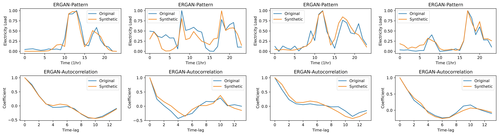
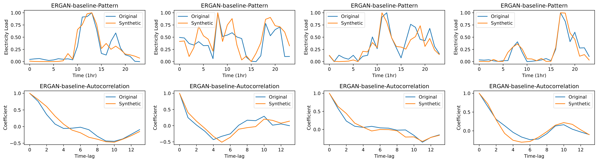
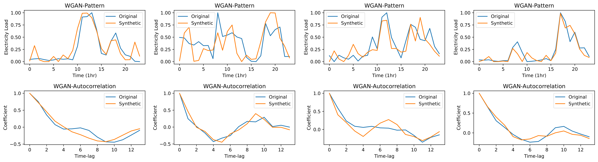
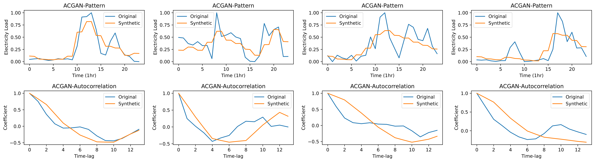
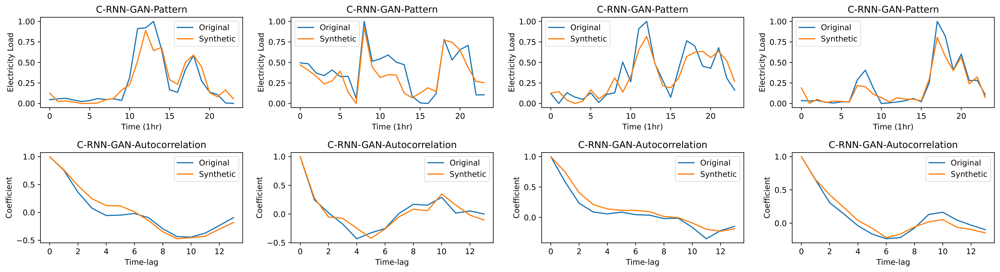

<b>Fig. 4</b>: Comparison of patterns and autocorrelation between original and synthetic residential load pattern samples using different generation methods.

### Comparative Histograms
These histograms provide a visual comparison of the distributions of original and synthetic load patterns, highlighting the statistical similarity achieved by ERGAN.

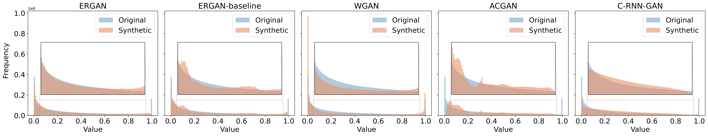

<b>Fig. 5</b>: Comparative histograms of original and synthetic residential load patterns using different generation methods.

### Hourly Comparative Boxplots
The boxplots show the hourly distribution of original and synthetic load patterns, demonstrating ERGAN's ability to accurately replicate daily consumption patterns.

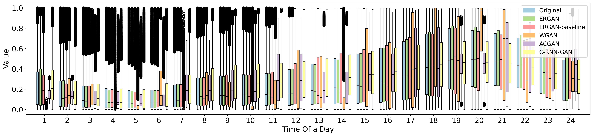

<b>Fig. 6</b>: Hourly comparative boxplots for original and synthetic load patterns generated by ERGAN and benchmark methods.

### T-SNE Visualization
The T-SNE visualization compares the high-dimensional structures of original and synthetic load patterns, indicating the effectiveness of ERGAN in preserving the data's manifold structure.

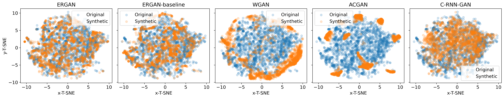

<b>Fig. 7</b>: T-SNE visualization comparing dimension-reduced load patterns of original and synthetic data across multiple generation methods.

## Dataset Location
The dataset is located under the following directory: [ergan_dataset](https://github.com/AdamLiang42/ERGAN-Dataset/tree/main/ergan_dataset).

Inside the [ergan_dataset](https://github.com/AdamLiang42/ERGAN-Dataset/tree/main/ergan_dataset) directory, you will find two distinct folders:

1. **Individual Model Outputs ([clustered_dataset](https://github.com/AdamLiang42/ERGAN-Dataset/tree/main/ergan_dataset/clustered_dataset))**: This folder contains separate files, each storing data generated by a different model from the ERGAN ensemble framework.
2. **Aggregated Data ([aggregrated_dataset](https://github.com/AdamLiang42/ERGAN-Dataset/tree/main/ergan_dataset/aggregrated_dataset))**: Due to GitHub's file size limits, the aggregated data is split across multiple files. These files collectively contain the aggregation of data produced by all the models.

Please choose the appropriate folder based on whether you're interested in the outputs of individual models or the collective results.

## Publications:
<!-- Welcome to cite our publications on this project. -->
TBD

## Acknowledgments:
We would like to acknowledge the sponsorship from FIT Startup Funding of Monash University and the Australian Research Council (ARC) Discovery Early Career Researcher Award (DECRA) under Grant DE230100046.

## License:
This *`ERGAN-Dataset`* is made available under the Open Database License: http://opendatacommons.org/licenses/odbl/1.0/. Any rights in individual contents of the database are licensed under the Database Contents License: http://opendatacommons.org/licenses/dbcl/1.0/.
